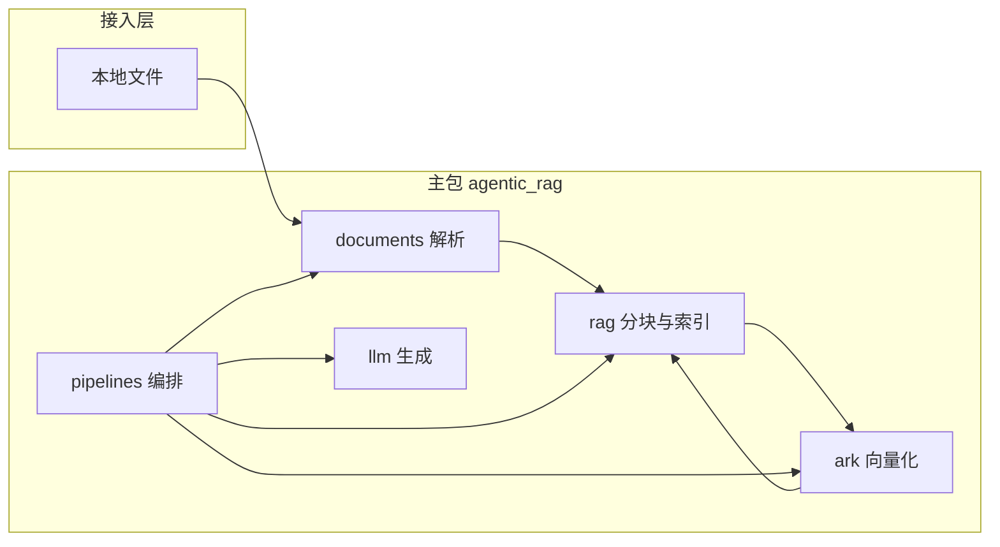

# 项目架构与协作说明

本文描述 **Agentic RAG** 的代码布局、数据流、模块职责与团队协作约定。使用方式与运行入口仍以根目录 [README.md](README.md) 为准。

---

## 1. 总览

本地文档 → **解析** → **分块** → **火山方舟多模态向量（仅文本项）** → **内存索引** → **余弦 Top-K** → **DeepSeek 对话生成**。



`pipelines` 是唯一把各层串成「一条 RAG 业务」的模块；底层包不依赖 `pipelines`，避免循环引用。

---

## 2. 目录树与职责

项目根仅保留**可执行入口**与工程元数据；可复用逻辑全部在 `src/agentic_rag/`。

```
项目根/
├── main.py                 # 入口：仅 DeepSeek 聊天（无 RAG）
├── demo.py                 # 入口：建索引后多轮提问
├── rag_demo.py             # 入口：单次「建索引 + 问答」
├── upload_demo.py          # 入口：Gradio 上传 + 问答
├── pyproject.toml
├── uv.lock
├── .env.example
├── .gitignore
├── README.md
├── ARCHITECTURE.md         # 本文件
└── src/
    └── agentic_rag/
        ├── __init__.py
        ├── config.py
        ├── documents/
        ├── ark/
        ├── llm/
        ├── rag/
        └── pipelines/
```

### 2.1 根文件

| 文件 | 作用 |
|------|------|
| `config.py`（包内） | 自项目根加载 `.env`，集中提供 `ARK_*`、`DEEPSEEK_*` 等配置，业务代码不直接散写 `os.getenv`。 |
| `main.py` | 验证 `DEEPSEEK_API_KEY` 后，单轮调用 DeepSeek。 |
| `demo.py` | 对指定路径建 `SimpleVectorIndex` 一次，循环读入问题并 `answer_with_index`；仅问题走向量化。 |
| `rag_demo.py` | 命令行两参数：文档路径 + 问题，内部 `local_rag_answer`（每次全链路）。 |
| `upload_demo.py` | Gradio UI：上传文件 + 问题，调用 `local_rag_answer`。 |

### 2.2 `src/agentic_rag/`（包根）

| 文件 | 作用 |
|------|------|
| `__init__.py` | 包版本等元信息。 |
| `config.py` | 方舟 Base URL、API Key、Embedding 模型与维度；DeepSeek Base URL、Key、对话模型名。 |

### 2.3 `documents/` — 文档接入

| 路径 | 作用 |
|------|------|
| `documents/__init__.py` | 对外导出 `parse_path`、`ParsedDocument`、`UnsupportedFormatError`。 |
| `documents/models.py` | `ParsedDocument` 数据结构（如路径、正文）。 |
| `documents/parse.py` | 按扩展名解析 `.txt` / `.md` / `.pdf` / `.docx` → 纯文本。 |
| `documents/errors.py` | `UnsupportedFormatError` 等解析侧异常。 |

### 2.4 `ark/` — 火山方舟向量

| 路径 | 作用 |
|------|------|
| `ark/__init__.py` | 导出 `embed_texts`。 |
| `ark/embeddings.py` | `POST .../embeddings/multimodal`；纯文本 RAG 使用 `input: [{"type":"text","text":...}]`；支持查询侧前缀与批处理/降级逐条请求。 |

### 2.5 `llm/` — 对话客户端

| 路径 | 作用 |
|------|------|
| `llm/__init__.py` | 导出 `create_deepseek_client`。 |
| `llm/deepseek.py` | 基于 OpenAI 兼容协议构造 DeepSeek 客户端，供 `pipelines` 与 `main.py` 使用。 |

### 2.6 `rag/` — 与厂商无关的检索核心

| 路径 | 作用 |
|------|------|
| `rag/__init__.py` | 导出 `SimpleVectorIndex`、`chunk_text`、`cosine_sim`。 |
| `rag/simple.py` | 固定窗口分块（含 overlap）、余弦相似度、内存中的向量与文本列表、`top_k` 检索。 |

### 2.7 `pipelines/` — 业务编排

| 路径 | 作用 |
|------|------|
| `pipelines/__init__.py` | 导出 `build_vector_index`、`answer_with_index`、`local_rag_answer`。 |
| `pipelines/local_rag.py` | `build_vector_index`：解析 → 分块 → `embed_texts(is_query=False)`；`answer_with_index`：问题 `embed_texts(is_query=True)` → Top-K → DeepSeek；`local_rag_answer` 为一次性封装。 |

---

## 3. 依赖方向（约定）

- 允许：`pipelines` → `documents` / `ark` / `llm` / `rag`。
- 禁止：`documents`、`ark`、`llm`、`rag` 依赖 `pipelines`。
- `config` 可被任意层读取；不在 `config` 以外重复实现「读 `.env`」逻辑（入口脚本通过首次 `import agentic_rag.*` 触发加载即可）。

---

## 4. 协作规范

### 4.1 环境与密钥

- 复制 `.env.example` 为本地 `.env`，**永不将 `.env`、密钥、Token 提交进仓库**。
- 提交前执行 `git status`，确认无敏感文件。
- 各成员在方舟 / DeepSeek 控制台自行创建密钥；模型 ID、Endpoint ID 以控制台为准。

### 4.2 依赖与运行

- 使用 **uv**：`uv sync` 安装锁定版本；新增依赖后更新 `pyproject.toml` 并执行 `uv lock`。
- Python 版本：`>=3.11`（见 `pyproject.toml`）。

### 4.3 Git 与提交信息

- 建议采用 [Conventional Commits](https://www.conventionalcommits.org/zh-hans/)：
  - `feat:` 新功能  
  - `fix:` 修复  
  - `docs:` 文档（含 `README` / `ARCHITECTURE.md`）  
  - `refactor:` 重构（行为不变）  
  - `chore:` 构建、依赖、杂项  
- 示例：`feat(ark): support optional embedding batch size`

### 4.4 代码与评审

- 与厂商相关的调用集中在 `ark/`、`llm/`；检索与分块逻辑留在 `rag/`，便于替换向量或 LLM 供应商。
- 新增目录或公共 API 时，同步更新 `ARCHITECTURE.md` 与本包 `__init__.py` 的导出。
- 避免在无关文件中「顺手重构」；合并请求保持单一主题，便于审查。

### 4.5 文档分工

- **README.md**：面向使用者的安装、配置、运行命令与简要说明。
- **ARCHITECTURE.md**：面向贡献者的结构、模块边界与协作约定（本文）。

---

## 5. 修订记录

架构或目录有重大变更时，请在本节或提交说明中简要记录，便于后来者溯源。
